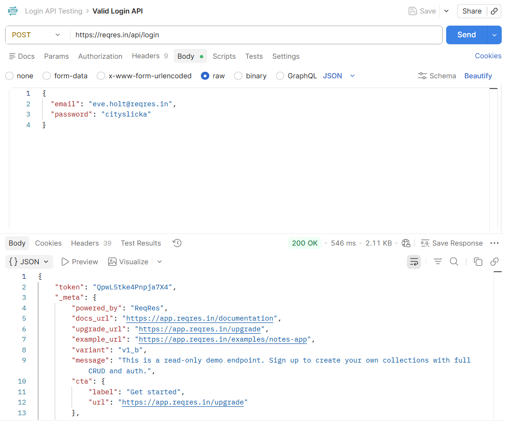
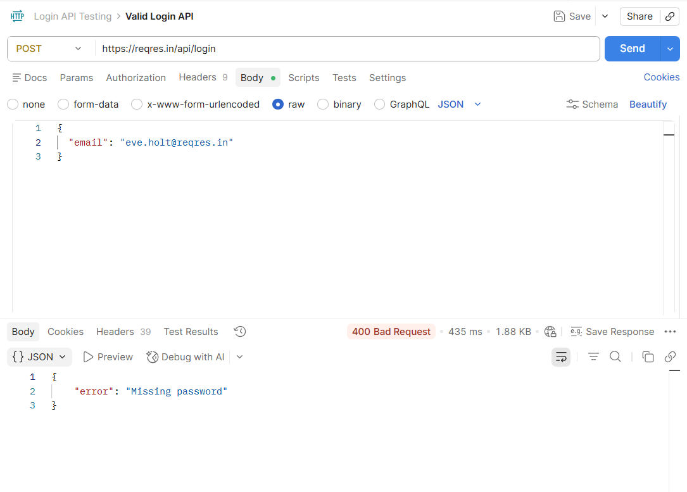

# API Testing Project using Postman

## Project Overview
This project demonstrates beginner-level API testing using Postman. It includes login API testing with positive and negative test scenarios.

## Tools Used
- Postman
- API Testing
- JSON
- Manual Testing

---

## Valid Login API Test

### Method
POST

### Endpoint
https://reqres.in/api/login

### Request Body

```json
{
  "email": "eve.holt@reqres.in",
  "password": "cityslicka"
}
```

### Expected Result
- Status code: 200 OK
- Login successful
- Token returned

### Screenshot



---

## Invalid Login API Test

### Method
POST

### Endpoint
https://reqres.in/api/login

### Request Body

```json
{
  "email": "eve.holt@reqres.in"
}
```

### Expected Result
- Status code: 400 Bad Request
- Error message displayed

### Screenshot



---

## Concepts Practiced
- GET Request
- POST Request
- Status Codes
- Headers
- Authentication
- Positive Testing
- Negative Testing
- API Response Validation
- Collections in Postman
